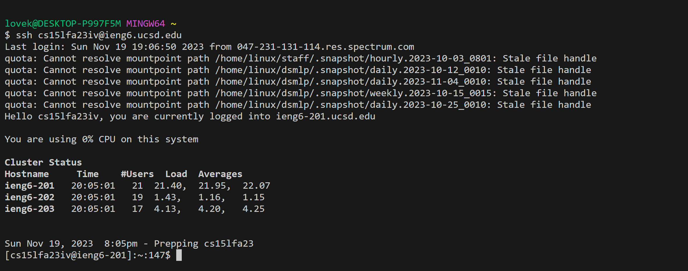

# CSE15L
## Lab 4
### step 4

Keypressed: ssh<space><ctrl>+<v><enter>

copy paste cs15lfa23iv@ieng6.ucsd.edu

### step 5 

Keypressed: 
            
            mkdir<space>cse15lLabReport4<enter>
            cd<space>cse15lLabReport4<enter>
            git<space>clone<ctrl>+<v><enter>
            ls<enter>

### step 6

Keypressed: cd<spqce>lab7<enter>
            ls<enter>
            bash<space>test.sh<enter>

### step 7

Keypressed: vim<space>L<tab>.java<enter>
            /index1<enter>nnnnnnnnn
            er2
            :wq<enter>
            bash t<tap>

### step 8

Keypressed: bash<space>t<tab><enter>

### step 9

Keypressed: git<space>add<space>L<tap><enter>
            git<space>commit<space>-m<space>"Update<space>ListExamples.java<space>line<space>44<space>index1<space>to<space>index2"<enter>
            git<space>status<enter>
            git<space>push<space>origin<space>main<enter>

            

